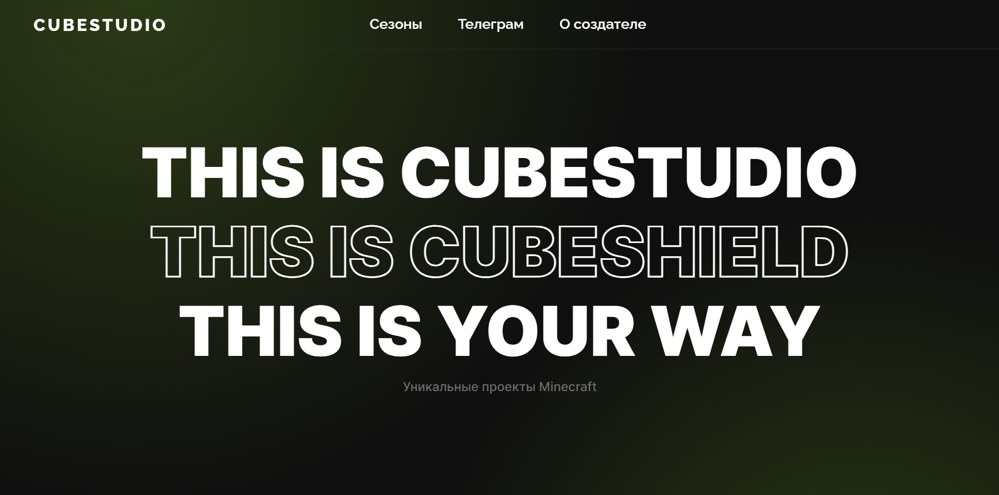

# CubeStudio

CubeStudio is a small, but pretty cozy <b>Minecraft</b> community that really like to play on SMP-like servers and that it is. There are already about 5 seasons of SMP that happened, and about 20 players, also that's not the end! This repository is a landing page for this project.

<a href="https://t.me/+Gphg_BIJEdMwMmFi">Telegram</a> |
<a href="https://fadegor05.github.io/CubeStudio/">Website</a>

# TODO

- Mobile version
- Optimize background
- Add sliders